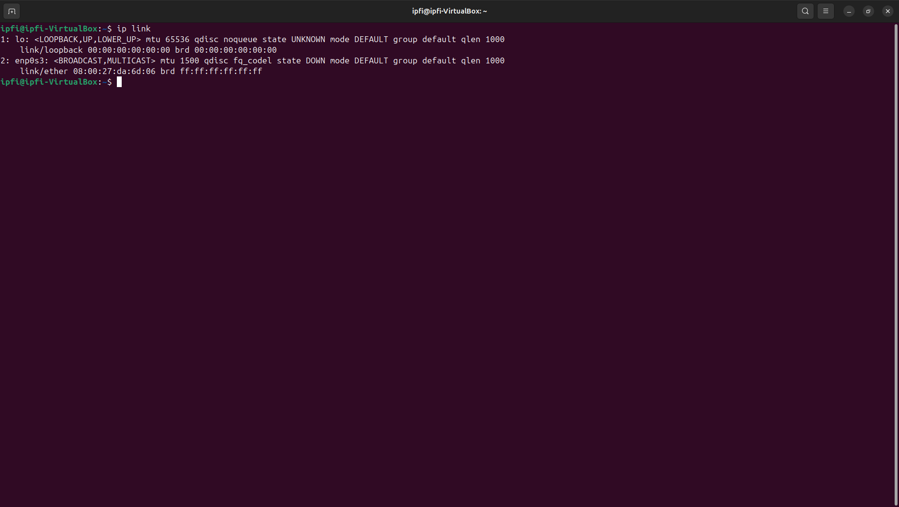

🐧 Ubuntu System Administration Lab (VirtualBox)
🔹 Overview

This lab demonstrates my hands-on experience administering and troubleshooting Ubuntu Linux in a VirtualBox environment. The focus includes network configuration, DNS troubleshooting, firewall management, process monitoring, SSH authentication analysis, and system performance diagnostics.

✅ 1. Network Interface Connectivity Issue
Problem

Network interface was DOWN and system had no connectivity.

Diagnosis

Checked interface status using:

ip link show
### Screenshot

Action Taken

Restored interface using:

sudo ip link set <interface> up

Result

Network connectivity restored successfully.

✅ 2. DNS Resolution Failure
Problem

System had network connectivity but could not browse websites.

Diagnosis

Checked DNS configuration file:

cat /etc/resolv.conf

Identified incorrect or missing nameserver entry.

Action Taken

Corrected DNS configuration in /etc/resolv.conf.

Result

Domain name resolution restored and internet browsing worked.

✅ 3. Firewall Blocking Service (UFW)
Problem

Incoming traffic was blocked due to firewall rules.

Diagnosis

Checked firewall status:

sudo ufw status
Action Taken

Allowed required service port:

sudo ufw allow 80/tcp

Result

Service became accessible and firewall rules updated successfully.

✅ 4. Frozen / Unresponsive Applications
Problem

Application stopped responding.

Diagnosis

Identified running processes:

ps aux | grep <application_name>

Found the PID of the unresponsive process.

Action Taken

Terminated process:

kill -9 <PID>

Result

System performance normalized and application restarted successfully.

✅ 5. SSH Login Failure Analysis
Scenario

Simulated failed login attempts using incorrect credentials.

Diagnosis

Reviewed authentication logs:

/var/log/auth.log

Result

Identified authentication failure messages and understood SSH security logging behavior.

✅ 6. High CPU Usage Simulation
Scenario

Simulated heavy CPU load.

Monitoring Tool Used
top

Result

Analyzed CPU utilization and identified high-resource processes.

✅ 7. Out-of-Memory (OOM) Event Analysis
Scenario

Simulated memory exhaustion.

Diagnosis

Reviewed kernel logs:

dmesg

Result

Observed Linux OOM killer behavior and understood how the system terminates processes under memory pressure.
