🐧 Ubuntu System Administration Lab (VirtualBox)
🔹 Overview

This lab demonstrates my hands-on experience administering and troubleshooting Ubuntu Linux in a VirtualBox environment. The focus includes network configuration, DNS troubleshooting, firewall management, process monitoring, SSH authentication analysis, and system performance diagnostics.

✅ 1. Network Interface Connectivity Issue
Problem

🔹 Step 1: Identified Network Interface Status

Command Used:

ip link

Observation:

The network interface enp0s3 was in DOWN state.

This indicated that the network adapter was not active, which explains why the system could not access external networks.

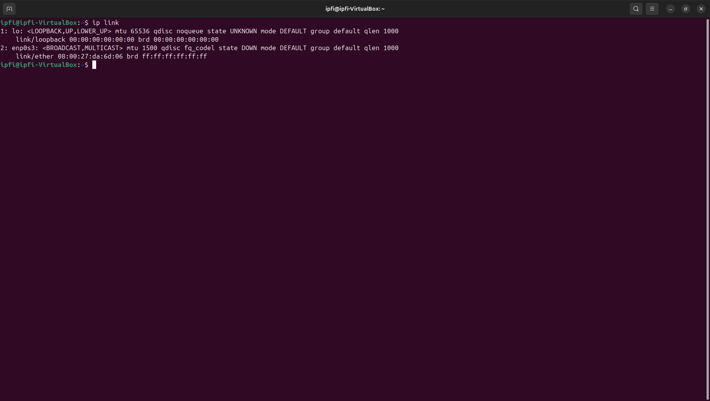

🔹 Step 2: Tested Internet Connectivity

Command Used:
ping -c 4 google.com

Observation:

The system returned:

Temporary failure in name resolution

This confirmed that the system could not resolve domain names due to the inactive network interface.

Screenshot:
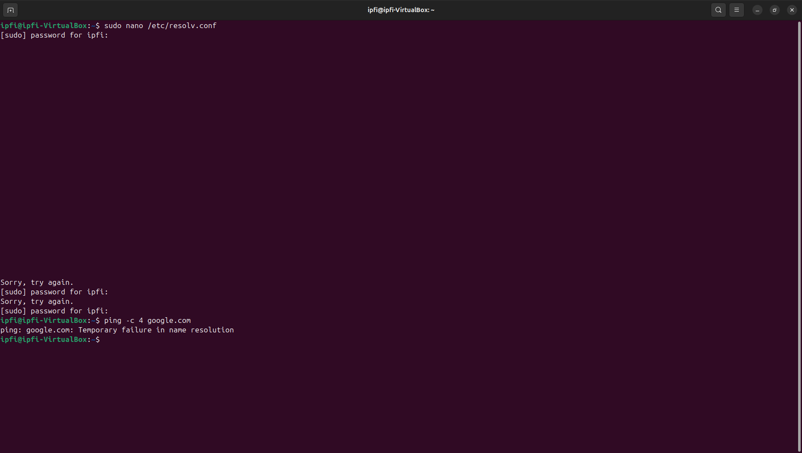

🔹 Step 3: Enabled Network Interface

Command Used:
sudo ip link set enp0s3 up

Action Taken:

Activated the network interface manually.

Screenshot:
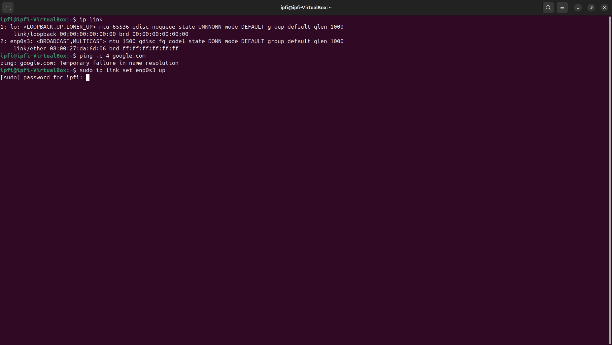

🔹 Step 4: Verified Interface Status

Command Used:
ip link show

Observation:

The interface enp0s3 status changed to:

state UP

This confirmed that the network adapter was successfully activated.

Screenshot:
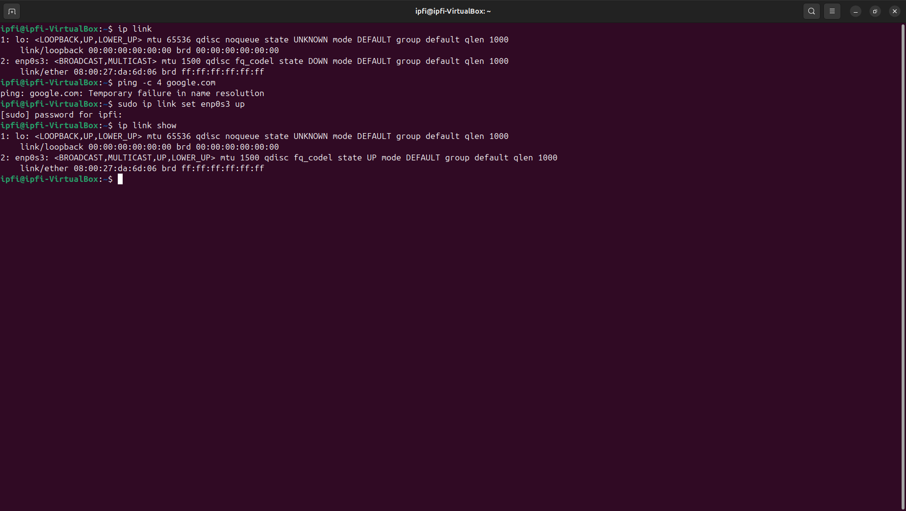

🔹 Step 5: Confirmed Internet Connectivity

Command Used:
ping -c 4 google.com

Result:

Successful replies received with:

0% packet loss

Valid RTT times

This confirmed full network restoration.

Screenshot:
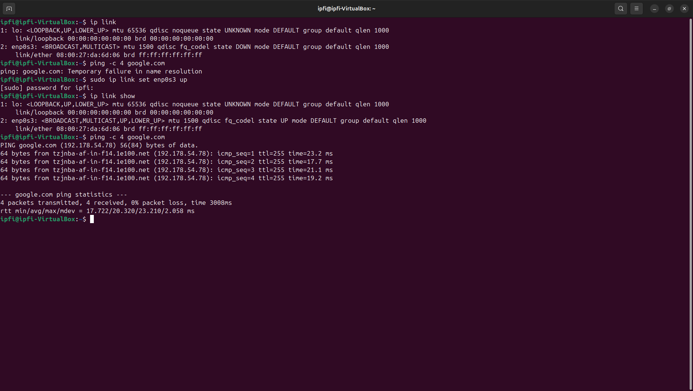

✅ 2. Resolving DNS Resolution Failure (Network Troubleshooting)
Problem

The system was unable to resolve domain names.
Attempting to access websites such as google.com resulted in a Temporary failure in name resolution error, even though internet connectivity appeared to be active.

Step 1: Verify DNS Configuration

Checked the DNS configuration file:

sudo nano /etc/resolv.conf

The file showed:

nameserver 127.0.0.53

This indicates the system is using the local stub resolver managed by systemd-resolved.

This configuration relies on an upstream DNS server. If that upstream DNS fails, domain name resolution will not work.

Screenshot

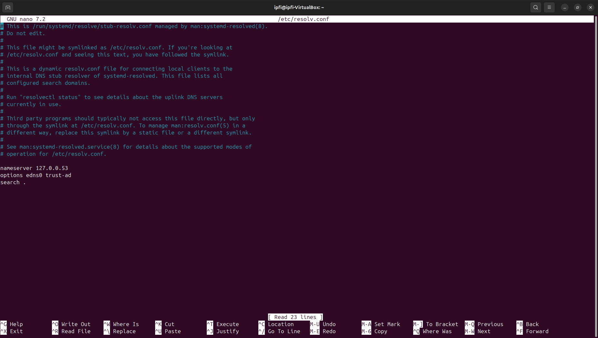

Step 2: Test Domain Name Resolution

Tested DNS resolution using:

ping -c 4 google.com

The system returned the error:

Temporary failure in name resolution

This confirms that the system could not translate the domain name into an IP address.

Screenshot

Step 3: Verify Network Connectivity

To confirm that the issue was DNS-related and not general network failure, tested connectivity using a direct IP address:

ping -c 4 8.8.8.8

The ping was successful with 0% packet loss.

This confirms:

Internet connectivity is working

Network routing is functioning properly

The issue is specifically related to DNS resolution

Screenshot

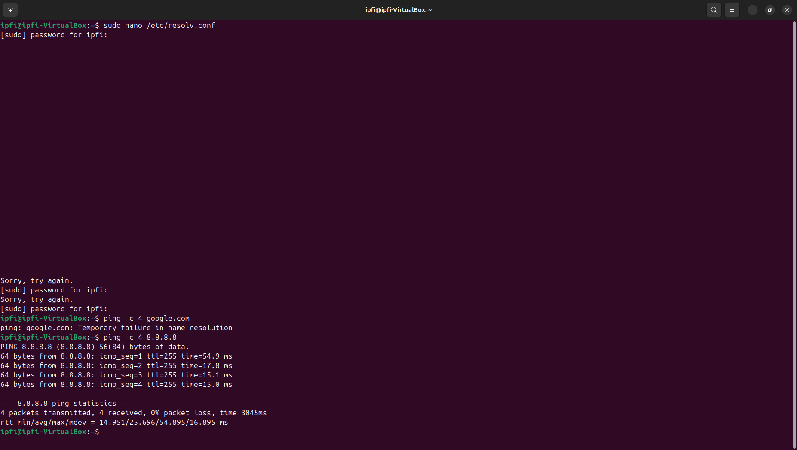

Step 4: Configure a Public DNS Server

Manually set Google Public DNS (8.8.8.8) for the network interface:

sudo resolvectl dns enp0s3 8.8.8.8

This command configures the system to use Google’s DNS server instead of the failing default resolver.

Screenshot

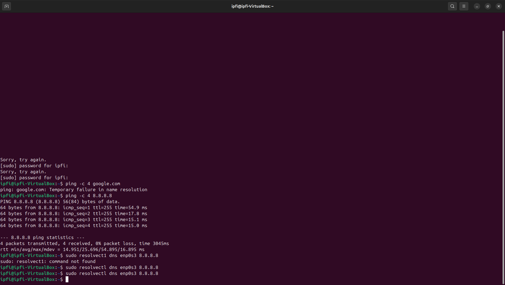

Step 5: Verify DNS Resolution After Fix

Retested domain name resolution:

ping -c 4 google.com

This time, the system successfully resolved google.com to its IP address and received replies with 0% packet loss.

This confirms that DNS resolution was successfully restored.

Screenshot

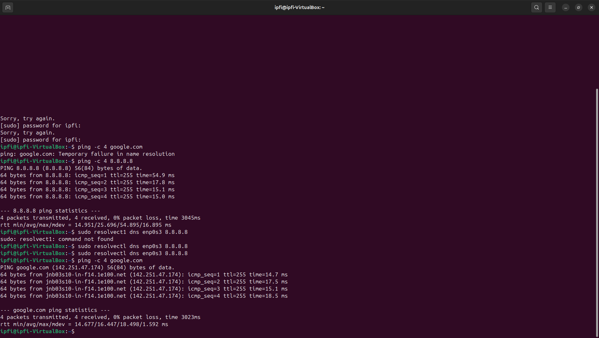

✅ 3. Firewall Blocking Service (UFW)

Managing Firewall Rules with UFW (Port 80)

Problem

Demonstrate how to block and allow HTTP traffic (Port 80) using UFW (Uncomplicated Firewall), and verify the firewall rule changes.

Step 1: Deny Port 80 (HTTP Traffic)

First, I blocked incoming HTTP traffic on port 80 using the following command:

sudo ufw deny 80/tcp

This command:

Adds a rule to deny incoming TCP traffic on port 80

Applies to both IPv4 and IPv6

The system confirmed:

Rule added

Rule added (v6)

Screenshot
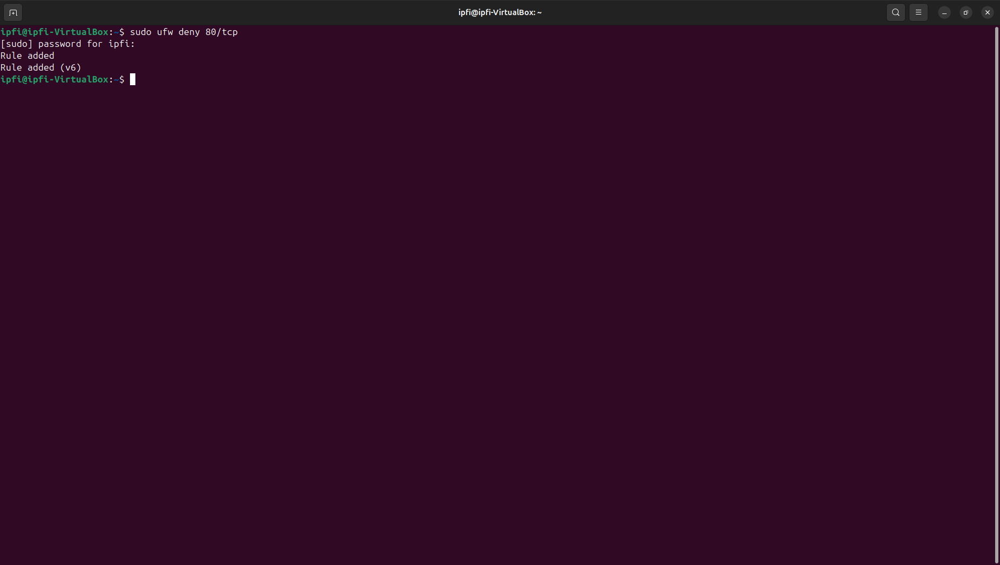

Step 2: Verify Firewall Rule (Numbered Status)

Next, I verified that the rule was successfully added by running:

sudo ufw status numbered

The output showed:

Status: active

80/tcp → DENY IN → Anywhere

80/tcp (v6) → DENY IN → Anywhere (v6)

This confirms that HTTP traffic was successfully blocked.

Screenshot

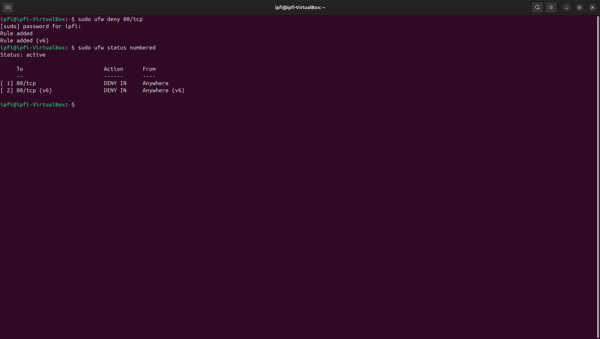

Step 3: Allow Port 80 (Restore HTTP Access)

After confirming the block, I restored access to port 80 using:

sudo ufw allow 80/tcp

This command updates the existing rule and allows incoming TCP traffic on port 80 for both IPv4 and IPv6.

The system confirmed:

Rule updated

Rule updated (v6)

Screenshot

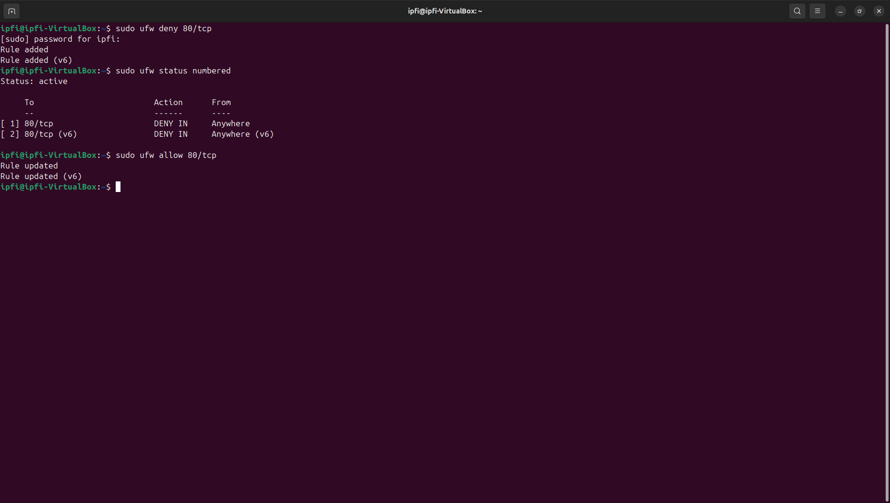

Step 4: Verify Updated Firewall Status

Finally, I checked the firewall status again:

sudo ufw status

The output showed:

Status: active

80/tcp → ALLOW → Anywhere

80/tcp (v6) → ALLOW → Anywhere (v6)

This confirms that HTTP traffic on port 80 is now permitted.

Screenshot

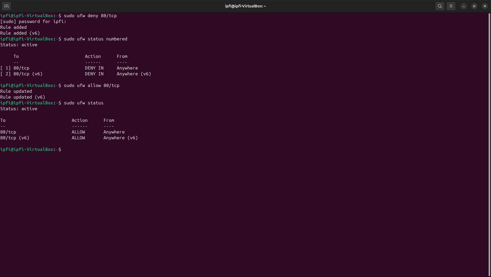

✅ 4. Frozen / Unresponsive Applications
Problem

LibreOffice became unresponsive and required manual process termination.

Step 1: Launch the Application

Opened LibreOffice to simulate a running application.

libreoffice

This confirmed that the application process was active in the system.

Screenshot

Step 2: Identify the Running Process and PID

Used the following command to locate the process ID (PID):

ps aux | grep libreoffice

The output displayed the running process:

/usr/lib/libreoffice/program/soffice.bin

PID identified: 5466

Screenshot
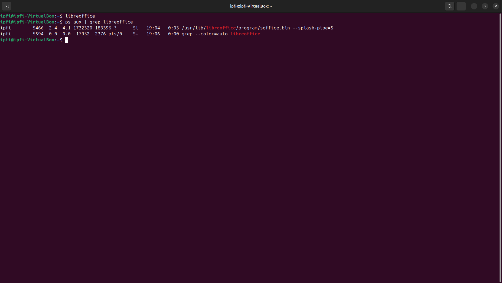

Step 3: Terminate the Frozen Process

Forcefully terminated the process using its PID:

sudo kill -9 5466

This command sends a SIGKILL signal to immediately stop the process.

Screenshot
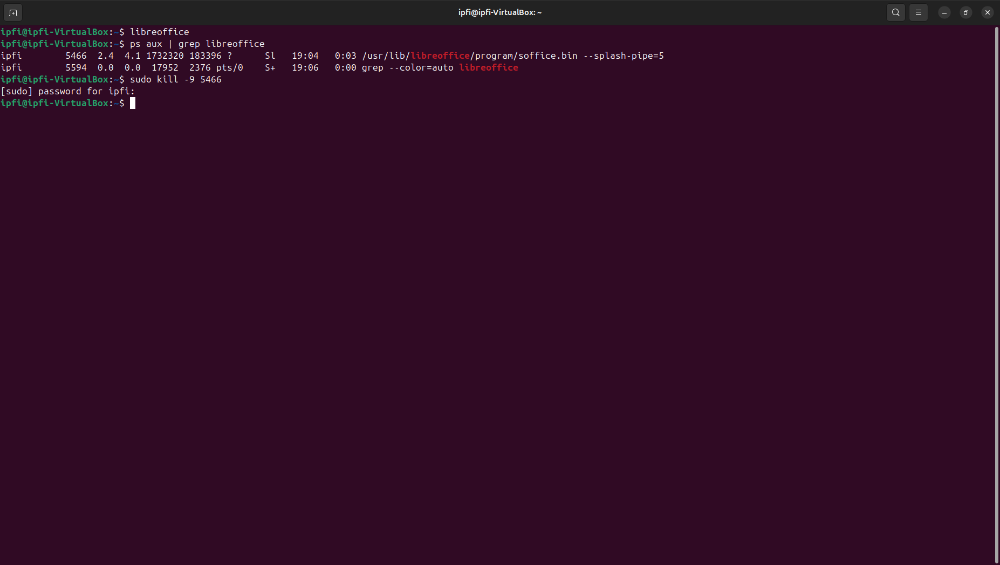

✅ 5. SSH Login Failure Investigation & Log Analysis

Problem

Unable to authenticate via SSH to remote host 192.168.18.45.
The system returns:

Permission denied (publickey,password).

The objective was to:

Attempt SSH connection

Observe authentication failure

Investigate system logs

Analyze failed login attempts

Step 1: Attempt SSH Connection to Remote Host

First, I attempted to connect to the remote machine using SSH:

ssh ipfi@192.168.18.45

During the first connection:

The system displayed the host authenticity warning.

I typed yes to add the host to known_hosts.

Entered the password multiple times.

Result:

Authentication failed.

Error displayed:
Permission denied (publickey,password).

This indicates:

Either wrong credentials

Or SSH authentication method mismatch

Or invalid user configuration

Screenshot

Step 2: Check Authentication Logs for Failed Password Attempts

To investigate the issue, I searched the authentication logs using:

sudo grep -a "Failed password" /var/log/auth.log

This command:

Searches /var/log/auth.log

Filters entries containing "Failed password"

Displays SSH authentication failures

The output showed:

Failed password attempts for user ipfi

Failed attempts from IP address 192.168.18.45

Invalid user attempts (e.g., fakeuser)

SSH daemon (sshd) log entries

This confirms the login failures were recorded by the system.

Screenshot

(Upload screenshot showing grep results from auth.log)

Step 3: Count and Analyze Failed Login Attempts by IP Address

To analyze how many times each IP attempted to log in, I used:

sudo grep -a "Failed password" /var/log/auth.log | awk '{print $(NF-3)}' | sort | uniq -c

This command pipeline performs:

grep → Filters failed password entries

awk '{print $(NF-3)}' → Extracts IP addresses

sort → Sorts IPs

uniq -c → Counts occurrences per IP

The output showed:

3 attempts from 127.0.0.1

2 attempts from 192.168.18.45

This helps identify:

Brute-force attempts

Suspicious login activity

Repeated authentication failures

Screenshot

(Upload screenshot showing IP count results)

✅ 6. High CPU Usage Simulation
Scenario

Simulated heavy CPU load.

Monitoring Tool Used
top

Result

Analyzed CPU utilization and identified high-resource processes.

✅ 7. Out-of-Memory (OOM) Event Analysis
Scenario

Simulated memory exhaustion.

Diagnosis

Reviewed kernel logs:

dmesg

Result

Observed Linux OOM killer behavior and understood how the system terminates processes under memory pressure.
